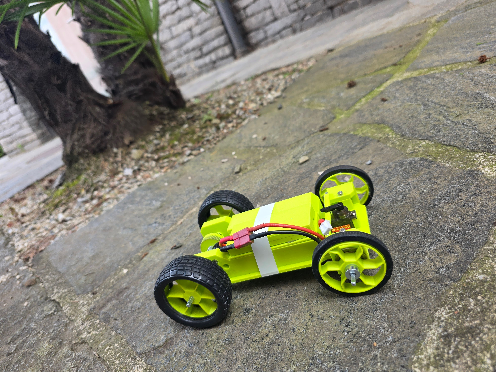

# Rock

Simple 3D printed RC car with a brushless drone motor. Drive it from your phone over WiFi.

<p align="center">
  
</p>
---

## Repo

- `firmware/controller/` — controller code
- `firmware/car/` — car code
- `cad/` — 3mf files to print

CAD on MakerWorld: TBD

---

## Parts

**Electronics**
- ReadyToSky MT2204 2300KV brushless drone motor
- EMAX Bullet 20A BLHeli-S ESC
- MG90S servo
- XIAO ESP32-S3 (controller)
- LilyGO T-Energy S3 (car)
- 2S 7.4V 1800mAh LiPo, T-plug ([Reely](https://www.conrad.ch/de/p/reely-modellbau-akkupack-lipo-7-4-v-1800-mah-zellen-zahl-2-racingpack-t-buchse-2901784.html))
- T-plug pigtail
- Wire

**Drivetrain**
- 10T pinion (store bought, fits motor shaft)
- 58T spur gear (printed)
- 1/4" (6.35 mm) square steel drive shaft
- 4x flanged ball bearings (~22 mm OD x ~7.6 mm ID x ~7 mm wide)
- 4x shaft collars for 1/4" square shaft
- Steering linkage

**3D printed parts**
- Body
- 58T spur gear
- 2x front wheels
- 2x rear wheels
- 2x steering knuckles (hold the front wheels, pivot for steering)
- 4x square inserts (adapt the round bearing to the square shaft)
- Battery cover
- ESP cover

**Hardware**
- M3 heat set inserts, screws, nuts
- 4x rubber tires for the printed wheels

---

## Wiring

Car ESP32:

```
ESC signal   -> GPIO 9
Servo signal -> GPIO 10
Servo V+     -> 5V (ESC BEC)
ESP32 5V     -> 5V (ESC BEC)
GND          -> GND
```

GPIO numbers refer to the ESP32 GPIO scheme, not silkscreen pin numbers. If you flash on a different ESP32 variant (XIAO ESP32-S3, ESP32-C3, etc.), check the board's pinout — GPIO 9/10 may map to a different physical pin.

LiPo to ESC via T-plug. Don't run USB and BEC into the ESP32 at the same time.

Controller is the XIAO on USB. No wiring.

---

## Flash

Arduino IDE, `esp32` core 2.0+ from Boards Manager.

Libraries:
- ESP32Servo
- WebSockets (Markus Sattler)

Open `firmware/controller/controller.ino`, pick your board, upload. Same for `firmware/car/car.ino` (LiPo unplugged when uploading).

ESC was set up once with BLHeli Suite using an Arduino Nano running the BLHeli passthrough sketch.

---

## Drive it

1. Power the controller.
2. Phone WiFi → `ROCK_RC`, password `12345678`.
3. Browser → `http://192.168.4.1`
4. Power the car. UI shows "Car: Connected".
5. Left stick throttle, right stick steering. Show Settings for trim, max speed, ramp step.

---

## Tuning

If forward/reverse or left/right is swapped, swap the values in `car.ino`:
- `ESC_FORWARD` / `ESC_REVERSE`
- `SERVO_LEFT` / `SERVO_RIGHT` (90 = center)

Trim, max speed, and ramp step are sliders in the UI.

---

## TODO

- CAD on MakerWorld
- Wiring diagram image
- Demo video
- Battery voltage in UI
- Proper retention for battery / ESC / ESP32 (snap-fit or clamps instead of tape)

---

## License

- Code (`firmware/`): MIT — see [LICENSE](LICENSE)
- CAD (`cad/`): CC BY-SA 4.0 — see [cad/LICENSE](cad/LICENSE)
